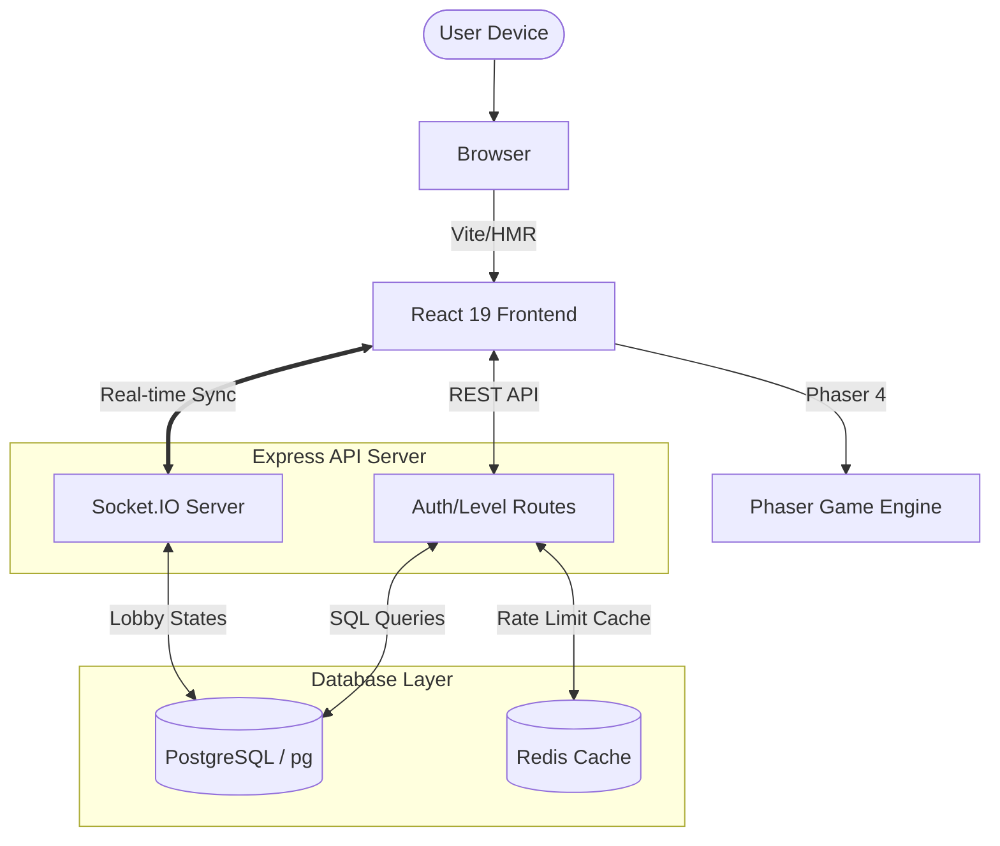

# [hoppers-game.com](http://hoppers-game.com/)

A high-fidelity level creation and multiplayer gaming platform.
Started Mar 15, 2026.

<p align="center">

</p>

## About the Project

Hoppers is a full-stack game development and sharing platform that combines a professional-grade level editor with real-time multiplayer capabilities. Users can hand-craft complex mechanical puzzles using a tile-based editor, share them with the community, and compete for the fastest completion times.

The platform is built with a unique "Luna Metallic Orchid" design language—a mechanical, tactile interface that prioritizes material depth and high-contrast material aesthetics over generic flat dashboard patterns.

## Features

- **Integrated Level Editor** - Build complex stages with a tile-based grid, custom physics objects (moving boxes, falling land), and interactive mechanics (ladders, flags, checkpoints).

- **Multiplayer Hub** - Social lobby system with real-time "ghost" sprite synchronization across networked game instances.

- **Community Library** - Browse, play, and "fork" levels created by other users. Track global leaderboards for every stage.

- **Character System** - Selection and persistence for unique player avatars (Nick/Sora) with synchronized animation states.

- **Metallic UI Engine** - Custom CSS material system implementing beveled surfaces, tactile controls, and high-fidelity depth hierarchies.

- **Real-time Networking** - Socket.IO integration for instant party readiness checks, lobby management, and game start synchronization.

- **Database Persistence** - PostgreSQL schema with migrations for levels, users, and save states, combined with Redis for hot data caching.

- **Rate Limiting & Security** - Robust API security for leaderboard submissions and auth routes using express-rate-limit and JWT.

## Technologies Used

| Layer    | Stack                                             |
| -------- | ------------------------------------------------- |
| Frontend | React 19, TypeScript, Phaser 4, Tailwind CSS      |
| Server   | Node.js, Express.js, TypeScript, Socket.IO        |
| Testing  | Vitest                                            |
| Database | PostgreSQL (pg), Redis                           |
| Build    | Vite, tsx                                         |



## Development & Deployment

### 1. Local Development

**A. Start Infrastructure**
Ensure you have a local PostgreSQL and Redis instance running.

**B. Start the Backend**
From the `server/` directory:

```bash
npm install
npm run dev
```

Server runs at `http://localhost:3000`

**C. Start the Frontend**
From the `client/` directory:

```bash
npm install
npm run dev
```

Frontend runs at `http://localhost:5173` with Vite HMR.

---

### 2. Deployment (Vercel)

To deploy this project to Vercel, you need to configure the project as a monorepo.

**A. Frontend Deployment**
Connect the `client/` directory to Vercel. Set the **Build Command** to `npm run build` and **Output Directory** to `dist`.

**B. Backend Deployment**
Vercel supports Express via Serverless Functions. Create a `vercel.json` in the root to route API requests to your server.

**Note**: Socket.IO requires a persistent server connection and may not function correctly on Vercel Serverless. For full multiplayer support, consider using **Railway** or **Render** for the `server/` directory.

### Testing

To run the project test suite, navigate to the `client/` or `server/` directory:

```bash
npm run test:run # Run Vitest suite
```
